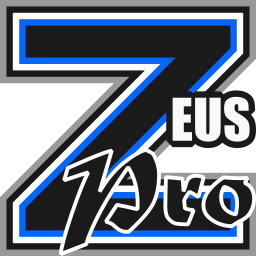

# Zeus Pro Unofficial

This project provides unofficial updates to Geeksoft's Zeus Pro e-fed management / wrestling simulator.

## Notable Changes
- Fixed crash when trying to open or save files on modern Windows (post XP).
- Removed install directory restrictions allowing portability.
- Updated help file so compatible with modern Windows.
- Update UI to use modern styling.
- Added modern icon set.
- Various usability changes such as correct tab movement.
- Added modern WWE RAW and SmackDown federation files.

Full details of changes can be found in;
- [Change log](CHANGES.md)
- [Detailed binary changes](binary_patches.md)
- [Detailed resource changes](resource_changes.md)
